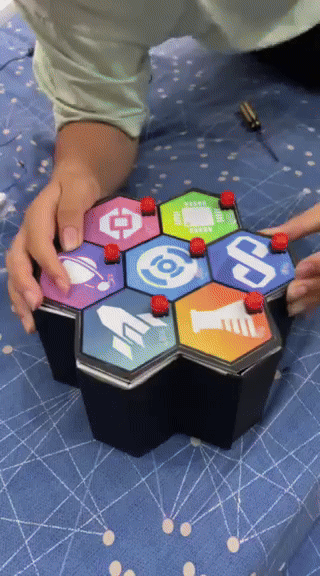

# Lê Hồng Phong Science Club - Button Game 

   

## Infomation 
The inspiration for the Button Game stems from the "Simon game," a classic toy featuring seven buttons and lights. Powered solely by a portable charger and an Arduino Uno board, our game challenges players to memorize and replicate a randomly generated sequence of illuminated buttons.

At the 2022 Vươn Lên Camp of Le Hong Phong High School for the Gifted, our club showcased this project to welcome incoming 10th graders. Through this interactive and memory-challenging game, we aimed to ignite students' passion for programming while demonstrating the creative potential of our club members.
## How it works 
 The game consists of 3 rounds:

- *<strong>Round 1: One light is turned on at a time</strong><code class="highlighter-rouge">(a total of 7 times).</code>*
    - Step 1: Randomly generate a sequence of 7 unique numbers using a marked array.
    - Step 2: Following the randomized sequence, turn on the lights one by one and check if the correct button is pressed. If incorrect, the player loses; otherwise, continue. (Checking method: Use a for loop to check each button to see if it's currently lit. Since the checking time for one button is less than 0.0000006s and the average button response time is 0.3s, the check will always be accurate.)

- *<strong>Round 2: Two lights are turned on at a time </strong><code class="highlighter-rouge">(a total of 3 times).</code>*
    - Step 1: Randomly generate a sequence of 7 unique numbers using a marked array.
    - Step 2: Following the randomized sequence, turn on two lights at a time and check if the correct two buttons are pressed. If incorrect, the player loses; otherwise, continue. (Checking method: Use a for loop to check each button to see if it's one of the two lit lights. If so, continue checking for 0.1s to see if the other lit button is pressed. If not, the game is over.)

- *<strong>Round 3: Randomly turn on 1 or 2 lights</strong><code class="highlighter-rouge">(the number of times turned on depends on the machine's random combination).*</code>
    - Step 1: Randomly generate a sequence of 7 unique numbers using a marked array.
    - Step 2: Randomly generate a light combination. If it's 1 light, check as in Round 1; if it's 2 lights, check as in Round 2.

## Components

<table class="table table-bordered" align="center">
  <thead class="thead-light">
    <tr>
      <th>Product's name</th>
      <th>Quantity</th>
      <th>Unit price</th>
      <th>Total</th>
    </tr>
  </thead>
  <tbody>
    <tr>
      <td><a href="https://banlinhkien.com/kit-arduino-uno-r3-ch340g-p6649363.html"><code class="highlighter-rouge">Arduino Uno</code></a></td>
      <td><code class="highlighter-rouge">1</code></td>
      <td><strong></strong>210.000 VNĐ</td>
      <td><strong></strong>210.000 VNĐ</td>
    </tr>
    <tr>
      <td><a href="https://banlinhkien.com/nut-nhan-4-chan-12x12x7.3mm-omron-b3f-5-chiec-p23584279.html"><code class="highlighter-rouge">Nút bấm 12mm</code></a></td>
      <td><code class="highlighter-rouge">2</code></td>
      <td><strong></strong>7.500 VNĐ</td>
      <td><strong></strong>15.000 VNĐ</td>
    </tr>
    <tr>
      <td><a href="https://banlinhkien.com/vo-nut-nhan-b3f-loai-vuong-5-chiec-p23379470.html"><code class="highlighter-rouge">Vỏ nút bấm</code></a></td>
      <td><code class="highlighter-rouge">2</code></td>
      <td><strong></strong>5.000 VNĐ</td>
      <td><strong></strong>10.000 VNĐ</td>
    </tr>
    <tr>
      <td><a href="https://banlinhkien.com/coi-chip-5v-5.5x9mm-p17504606.html"><code class="highlighter-rouge">Còi chip</code></a></td>
      <td><code class="highlighter-rouge">1</code></td>
      <td><strong></strong>4.000 VNĐ</td>
      <td><strong></strong>4.000 VNĐ</td>
    </tr>
    <tr>
      <td><a href="https://banlinhkien.com/led-5mm-tim-ss-5c-p6651436.html"><code class="highlighter-rouge">Led tím</code></a></td>
      <td><code class="highlighter-rouge">1</code></td>
      <td><strong></strong>4.000 VNĐ</td>
      <td><strong></strong>4.000 VNĐ</td>
    </tr>
    <tr>
      <td><a href="https://banlinhkien.com/led-5mm-vang-duc-10c-p6651427.html"><code class="highlighter-rouge">Led vàng</code></a></td>
      <td><code class="highlighter-rouge">1</code></td>
      <td><strong></strong>3.500 VNĐ</td>
      <td><strong></strong>3.500 VNĐ</td>
    </tr>
    <tr>
      <td><a href="https://banlinhkien.com/led-5mm-xanh-la-duc-10c-p6649056.html"><code class="highlighter-rouge">Led xanh lá </code></a></td>
      <td><code class="highlighter-rouge">1</code></td>
      <td><strong></strong>3.500 VNĐ</td>
      <td><strong></strong>3.500 VNĐ</td>
    </tr>
    <tr>
      <td><a href="https://banlinhkien.com/led-5mm-xanh-duong-duc-10c-p6649055.html"><code class="highlighter-rouge">Led xanh dương</code></a></td>
      <td><code class="highlighter-rouge">1</code></td>
      <td><strong></strong>3.500 VNĐ</td>
      <td><strong></strong>3.500 VNĐ</td>
    </tr>
    <tr>
      <td><a href="https://banlinhkien.com/led-5mm-do-duc-10c-p6651526.html"><code class="highlighter-rouge">Led đỏ</code></a></td>
      <td><code class="highlighter-rouge">1</code></td>
      <td><strong></strong>3.500 VNĐ</td>
      <td><strong></strong>3.500 VNĐ</td>
    </tr>
    <tr>
      <td><a href="https://banlinhkien.com/led-5mm-hong-ss-10c-p6651443.html"><code class="highlighter-rouge">Led hồng</code></a></td>
      <td><code class="highlighter-rouge">1</code></td>
      <td><strong></strong>5.000 VNĐ</td>
      <td><strong></strong>5.000 VNĐ</td>
    </tr>
    <tr>
      <td><a href="https://banlinhkien.com/led-5mm-trang-duc-10c-p6649054.html"><code class="highlighter-rouge">Led trắng</code></a></td>
      <td><code class="highlighter-rouge">1</code></td>
      <td><strong></strong>3.500 VNĐ</td>
      <td><strong></strong>3.500 VNĐ</td>
    </tr>
    <tr>
      <td><code class="highlighter-rouge">Băng keo 2 mặt</code></td>
      <td><code class="highlighter-rouge">1</code></td>
      <td><strong></strong>6.000 VNĐ</td>
      <td><strong></strong>6.000 VNĐ</td>
    </tr>
  </tbody>
</table>

## INSIDE

<video width="320" height="240" controls>
  <source src="Video/Super_idol.mp4" type="video/mp4">
</video>